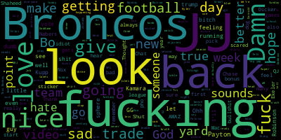

# Fantasy Football Word Cloud

Quick word cloud configuration of our word cloud chat

---

## Download Chat

1. Open WhatsApp and go to the chat you want to export (in this case, the "Mile High Showdown" chat).
2. Tap on the three dots (⋯) in the top right corner of the screen.
3. Select "More" and then "Export chat".
4. Choose whether you want to export the chat with or without media (photos, videos, etc.).
5. Select a method to export the chat, such as email or saving to a file.
6. If prompted, choose a format for the exported chat (usually TXT or ZIP).

---

## Prep

1. Unzip the file: Right-click on the ZIP file and select "Extract All" or "Unzip" (the exact option may vary depending on your device and operating system).
2. Find the text file: Inside the unzipped folder, look for a file with a .txt extension (usually named "chat.txt" or something similar).
3. Share the text file: Copy and paste the contents of the text file into a message, and I'll receive it.

---

## Running

After adjusting the word list, you can configure how many lines it looks at, currently it slices the timestamp, and there are some hardcoded words that were removed.

```shell
poetry install
## Run this as part of the main.py `nltk.download('stopwords')`
poetry run python main.py
```

---

That should generate the wordcloud.png similar to below

